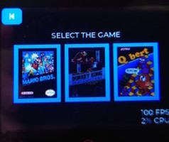

# ESP32-NESEMU, a Nintendo Entertainment System emulator for the ESP32 (IDF v5)
====================================================================

This is a quick and dirty port of Nofrendo, a Nintendo Entertainment System emulator. It lacks sound, but can emulate a NES at close to full speed, albeit with some framedrop due to the way the display is driven. 

The portation of NES emulator is based on [ESP-BSP](https://github.com/espressif/esp-bsp) code and it allows to change the board quickly. 

|  Selection of the game  | Super Mario | Donkey Kong | qBert |
| :----------: | :-----------: | :----------: | :----------: |
|  |  |  |  |

## Warning
-------

This is a proof-of-concept (only for demo) and not an official application note. As such, this code is entirely unsupported by Espressif.

## USB HID Controller
---------

The games are controlled by USB HID SNES GamePad. 


## Build and flash
---------

```
idf.py -p COMx flash monitor
```

## Board selection
---------

For change the board, please edit the [`components/esp_nes/idf_component.yml`](components/esp_nes/idf_component.yml) file and change these lines to another BSP component:

```
ws_7inch:
    version: "bsp/7inch_update"
    path: "SquareLine/boards/custom_waveshare_7inch/components/ws_7inch/"
    git: https://github.com/espressif/esp-bsp.git
```

For example, you can use this for ESP-BOX:

```
esp-box: "*"
```

## ROM
---
This NES emulator does not come with a ROM. This demo allows to select between three games, each game must be flashed to right flash region:

1. Game: `0x00100000`
2. Game: `0x00200000`
3. Game: `0x00300000`

You can use this command for flash the game into right flash region:

```
python esptool.py --chip esp32s3 --port "COM3" --baud $((230400*4)) write_flash -fs 4MB 0x100000 .\games\supermario.nes
```

## Copyright
---------

Code in this repository is Copyright (C) 2016 Espressif Systems, licensed under the Apache License 2.0 as described in the file LICENSE. Code in the
components/nofrendo is Copyright (c) 1998-2000 Matthew Conte (matt@conte.com) and licensed under the GPLv2.

